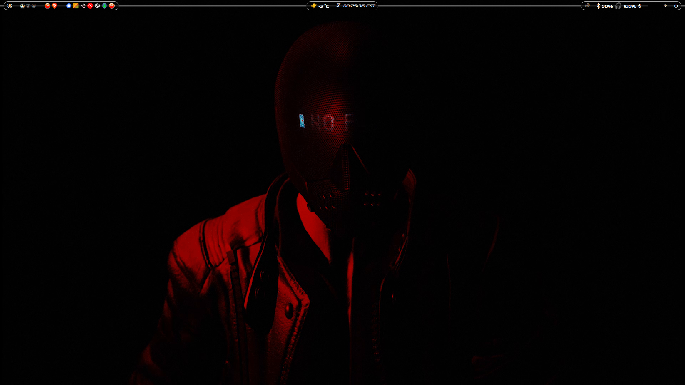
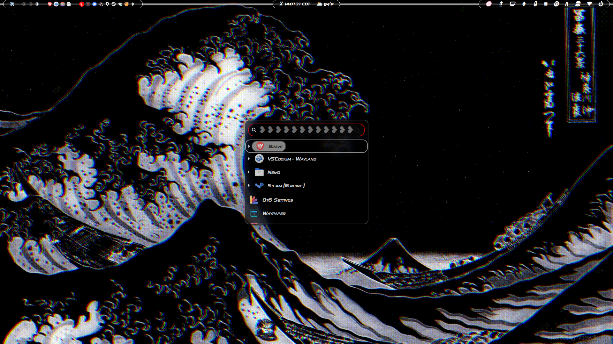
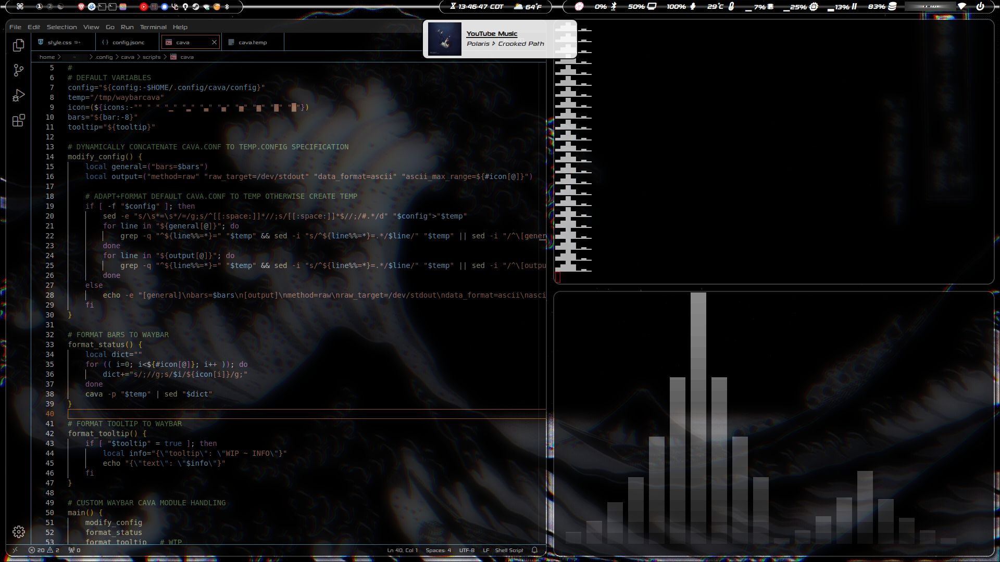

    <h1>【 Arch Linux Wayland Rice 】</h1>

</a>

## Features
- **Boot Manager**: *([refind](https://www.rodsbooks.com/refind)+[refind-theme-darkmini-git](https://github.com/LightAir/darkmini))*
- **Display Manager**: *[ly](https://github.com/fairyglade/ly)*
- **Window Manager**: *[hyprland](https://github.com/hyprwm/Hyprland) / [swayfx](https://github.com/WillPower3309/swayfx)*
- **Lock Screen**: *[hyprlock](https://github.com/hyprwm/hyprlock) / [swaylock-corrupter](https://github.com/r00tman/corrupter)*
- **Status Bar**: *([waybar](https://github.com/Alexays/Waybar)+[waybar-updates](https://github.com/L11R/waybar-updates)+[wttrbar](https://github.com/bjesus/wttrbar))*
- **Notification Daemon**: *[mako](https://github.com/emersion/mako)*
- **Terminal**: *[kitty](https://github.com/kovidgoyal/kitty)*
- **Shell**: *([bash](https://git.savannah.gnu.org/cgit/bash.git)+[oh-my-bash-git](https://github.com/ohmybash/oh-my-bash)) & ([fish](https://github.com/fish-shell/fish-shell)+(~~[Oh My Fish](https://github.com/oh-my-fish/oh-my-fish)~~ / [fish-tide-git](https://github.com/IlanCosman/tide))) & ([git](https://github.com/git/git)+[oh-my-git](https://github.com/arialdomartini/oh-my-git)) & [github-cli](https://github.com/cli/cli)*
- **Font**: *[sony-sketch-ef-font](http://www.ffonts.net/Sony-Sketch-EF.font) & [ttf-maple](https://github.com/subframe7536/maple-font)*
- **Package Manager**: *[yay-bin](https://github.com/Jguer/yay)*
- **Application Launcher**: *([wofi](https://hg.sr.ht/~scoopta/wofi)+[wofi-calc](https://github.com/Zeioth/wofi-calc.git)+[wofi-emoji](https://github.com/Zeioth/wofi-emoji))*
- **Wallpaper Setter**: *[waypaper-engine](https://github.com/0bCdian/Waypaper-Engine)*
- **File Manager**: *[thunar](https://docs.xfce.org/xfce/thunar/start) & [ranger](https://github.com/ranger/ranger)*
- **Text Editor**: *[vscodium-bin](https://github.com/VSCodium/vscodium) & [neovim](https://github.com/neovim/neovim)*
- **Media**: *[youtube-music-bin](https://github.com/th-ch/youtube-music) & [imv](https://sr.ht/~exec64/imv/) & [mpv](https://github.com/mpv-player/mpv) & [cava](https://github.com/karlstav/cava)*
- **System Monitor**: *[btop](https://github.com/aristocratos/btop)*
- **Tweak**: *[gnome-tweaks](https://gitlab.gnome.org/GNOME/gnome-tweaks) & ([qt5ct](https://qt5ct.sourceforge.io/)+[qt6ct](https://github.com/trialuser02/qt6ct)) & (~~[archlinux-tweak-tool-git](https://github.com/arcolinux/archlinux-tweak-tool)~~ - "Underdeveloped")*
- **OTHER**: *[PACKAGES](PACKAGES)*

## Additionals
1. **Scripts:**
   - [mako.sh](.config/wofi/scripts/mako.sh): *Wofi notification Dismissal, Disable, and Enable.*
   - [powermenu.sh](.config/wofi/scripts/powermenu.sh): *No Wofi powermenu package in AUR, though I'm considering [wlogout](https://github.com/ArtsyMacaw/wlogout) or [eww](https://github.com/elkowar/eww).*
   - [battery.sh](.config/hypr/scripts/battery.sh): Thanks to [end-4](https://github.com/end-4) for the hyprlock battery [status.sh](https://github.com/end-4/dots-hyprland/blob/main/.config/hypr/hyprlock/status.sh) script!
   - 😵 - *`I had more, but I'm brain dead (check older activity).`*
2. **WIP.configs:**
   - [.bashrc](.bashrc): *More room for improvement, including install_packages() method.*
   - [config.jsonc](.config/waybar/config.jsonc): *Explained in Waybar modules layout.*
   - [style.css](.config/waybar/style.css): *Adjusting center-line visibility between Waybar modules only.*

## ✨Thank You
   😁 - *`Welcoming all new and improved commits!`*

