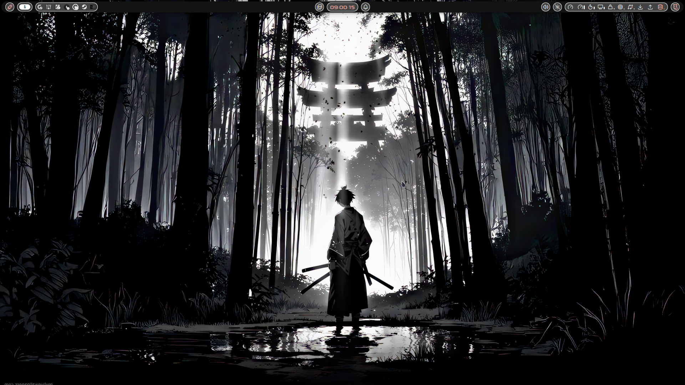
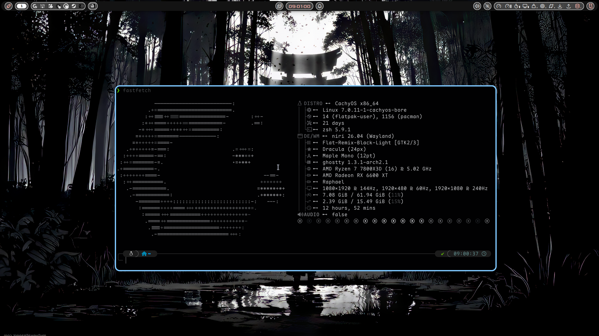
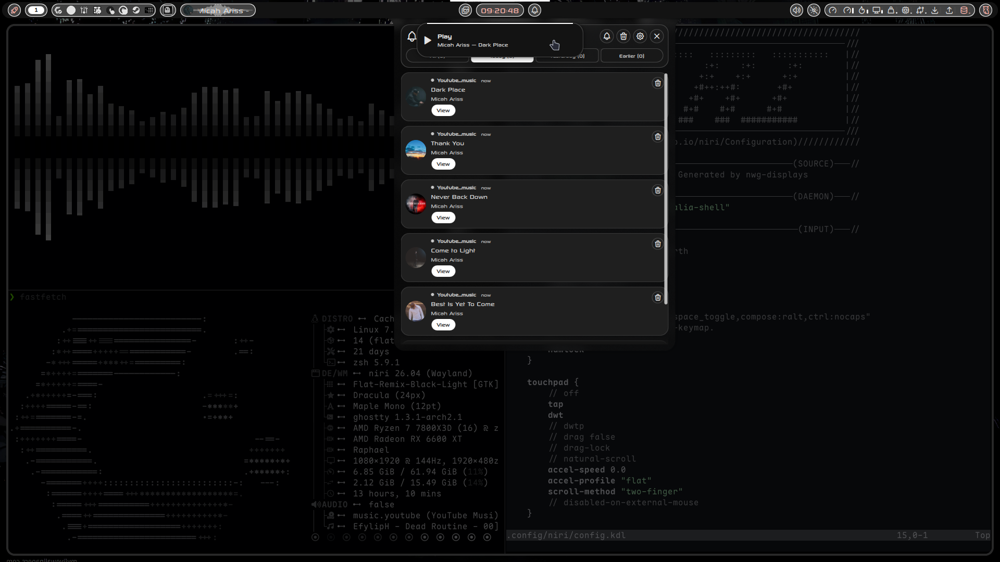

<!---- DOTFILES ---->

## 🥡 ✦ QUALITY_DOTFILES ✦ 🥢

---

<!---- PREVIEWS ---->

<strong>🍚 ✦ QUALITY_RICE ✦ 🥢</strong>

 
   
   
   

<!---- WALLPAPERS ---->

<strong>🍙 ✦ QUALITY_WRAPS ✦ 🥢</strong>

<em>
 
  <a href="https://youtu.be/dQw4w9WgXcQ?si=G625CuH-dlr8NzlP">✦ ANY_MEDIA_FORMAT ✦</a> 
  <a href="https://moewalls.com">MoeWalls</a> 
  <a href="https://wallhaven.cc">Wallhaven</a> 
  <a href="https://wallpapercave.com">WallpaperCave</a> 
  <a href="https://wall.alphacoders.com">Alpha Coders</a> 
  <a href="https://unsplash.com">Unsplash</a> 
  <a href="https://cloudconvert.com/">✦ CloudConvert ✦</a> 

</em>

---

<table>

<tr>
  <th>FEATURE</th>
  <th>NAME</th>
  <th>THEME</th>
</tr>

<!---- SYSTEM ---->
<tr>
  <td>DISTRIBUTION</td>
  <td><em>
    <a href="https://archlinux.org">Arch Linux</a>
  </em></td>
  <td><em>
    <a href="https://cachyos.org/">CachyOS</a> |
    <a href="https://blackarch.org/">BlackArch</a> |
    <a href="https://wayland.freedesktop.org">Wayland</a>
  </em></td>
</tr>

<tr>
  <td>BOOT MANAGER</td>
  <td><em>
    <a href="https://github.com/systemd/systemd">systemd-boot</a>
  </em></td>
  <td><em>
    <a href="https://github.com/anatol/booster">booster</a> +
    <a href="https://github.com/Zile995/booster-um">booster-um</a>
  </em></td>
</tr>

<tr>
  <td>DISPLAY MANAGER</td>
  <td><em>
    <a href="https://github.com/fairyglade/ly">ly</a>
  </em></td>
  <td><em>
    —
  </em></td>
</tr>

<!---- DESKTOP ---->
<tr>
  <td>DE / WM</td>
  <td><em>
    <a href="https://github.com/YaLTeR/niri">niri</a> |
    <a href="https://github.com/hyprwm/Hyprland">hyprland</a>
  </em></td>
  <td><em>
    <a href="https://gitlab.freedesktop.org/xdg/xdg-utils">xdg-utils</a>
  </em></td>
</tr>

<tr>
  <td>DESKTOP SHELL</td>
  <td><em>
    <a href="https://github.com/noctalia-dev/noctalia">noctalia</a>
  </em></td>
  <td><em>
    STATUS BAR |
    NOTIFICATIONS |
    WALLPAPER SETTER |
    APPLICATION MANAGER
  </em></td>
</tr>

<tr>
  <td>WALLPAPER SETTER</td>
  <td><em>
    <a href="https://github.com/anufrievroman/waypaper">waypaper</a>
  </em></td>
  <td><em>
    <a href="https://github.com/Nomadcxx/gSlapper">gslapper</a> |
    <a href="https://codeberg.org/LGFae/awww">awww</a> |
    <a href="https://codeberg.org/explosion-mental/wallust">wallust</a>
  </em></td>
</tr>

<tr>
  <td>QT</td>
  <td><em>
    <a href="https://qt6ct.sourceforge.io">qt6ct</a> |
    <a href="https://qt5ct.sourceforge.io">qt5ct</a>
  </em></td>
  <td><em>
    <a href="https://www.opencode.net/trialuser/qt6gtk2">qt6gtk2</a> |
    <a href="https://github.com/trialuser02/qt5gtk2">qt5gtk2</a>
  </em></td>
</tr>

<tr>
  <td>GTK</td>
  <td><em>
    <a href="https://github.com/nwg-piotr/nwg-look">nwg-look</a>
  </em></td>
  <td><em>
    <a href="https://github.com/daniruiz/Flat-Remix-GTK">flat-remix-gtk</a> |
    <a href="https://github.com/daniruiz/Flat-Remix">flat-remix</a> |
    <a href="https://github.com/BlackArch/blackarch-config-cursor">blackarch-config-cursor</a>
  </em></td>
</tr>

<tr>
  <td>AUDIO</td>
  <td><em>
    <a href="https://github.com/saivert/pwvucontrol">pwvucontrol</a>
  </em></td>
  <td><em>
    <a href="https://pipewire.org">pipewire</a> |
    <a href="https://pipewire.pages.freedesktop.org/wireplumber/">wireplumber</a> |
    <a href="https://gitlab.freedesktop.org/pipewire/helvum">helvum</a>
  </em></td>
</tr>

<!---- SHELL / DEV ---->
<tr>
  <td>SHELL</td>
  <td><em>
    <a href="https://git-scm.com">git</a> |
    <a href="https://www.gnu.org/software/bash/">bash</a> |
    <a href="https://www.zsh.org/">zsh</a>
  </em></td>
  <td><em>
    <a href="https://github.com/yadm-dev/yadm">yadm</a> |
    <a href="https://github.com/arialdomartini/oh-my-git">oh-my-git</a> |
    <a href="https://github.com/ohmybash/oh-my-bash">oh-my-bash</a> |
    <a href="https://github.com/ohmyzsh/ohmyzsh">oh-my-zsh</a>
  </em></td>
</tr>

<tr>
  <td>PACKAGE MANAGER</td>
  <td><em>
    <a href="https://www.archlinux.org/pacman">pacman</a> |
    <a href="https://flatpak.org">flatpak</a>
  </em></td>
  <td><em>
    <a href="https://github.com/morganamilo/paru">paru</a>
  </em></td>
</tr>

<tr>
  <td>FONT</td>
  <td><em>
    <a href="http://www.ffonts.net/Sony-Sketch-EF.font">sony-sketch-ef-font</a> |
    <a href="https://github.com/xeji01/nothingfont">otf-nothing-font-git</a>
  </em></td>
  <td><em>
    —
  </em></td>
</tr>

<!---- APPS ---->
<tr>
  <td>TERMINAL</td>
  <td><em>
    <a href="https://github.com/ghostty-org/ghostty">ghostty</a>
  </em></td>
  <td><em>
    —
  </em></td>
</tr>

<tr>
  <td>FILE MANAGER</td>
  <td><em>
    <a href="https://github.com/sxyazi/yazi">yazi</a> |
    <a href="https://github.com/linuxmint/nemo">nemo</a>
  </em></td>
  <td><em>
    <a href="https://vscodium.com">vscodium-electron-bin</a> |
    <a href="https://neovim.io">neovim</a> |
    <a href="https://www.vim.org">gvim</a>
  </em></td>
</tr>

<!---- MEDIA / TOOLS ---->
<tr>
  <td>MEDIA</td>
  <td><em>
    <a href="https://obsproject.com">obs-studio</a> |
    <a href="https://github.com/nabiko02/recway">recway</a> |
    <a href="https://flameshot.org">flameshot</a>
  </em></td>
  <td><em>
    <a href="https://github.com/eXeC64/imv">imv</a> |
    <a href="https://mpv.io">mpv</a> |
    <a href="https://github.com/karlstav/cava">cava</a>
  </em></td>
</tr>

</table>

