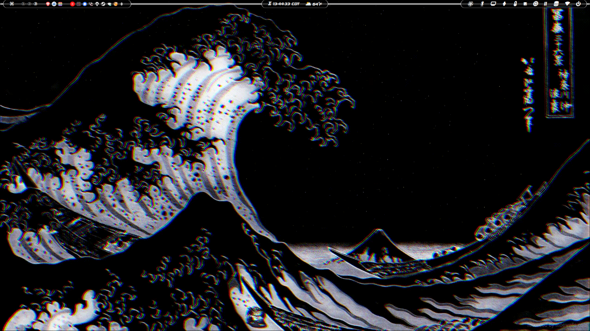

<h1>

  【 🍚 】
</h1><h2>

  
  
  
  
  
</h2></a>

👀-CANDY─(MOLDY)

  
  
  
  
  ───THE_DEEPER_YOU_LOOK_THE_MORE_YOU_FIND───

WALLPAPERS

  - [Ramen Great Wave off Kanagawa](https://moewalls.com/abstract/ramen-great-wave-off-kanagawa-live-wallpaper)
  - [The Great Wave off Kanagawa](https://moewalls.com/abstract/the-great-wave-off-kanagawa-live-wallpaper)
  - [Autumn Tree - Ghost of Tsushima](https://moewalls.com/games/autumn-tree-ghost-of-tsushima-live-wallpaper)
  - [Crimson Sun](https://moewalls.com/abstract/crimson-sun-live-wallpaper)
  - [No File - Ruiner](https://moewalls.com/sci-fi/no-file-ruiner-live-wallpaper)
  - [[LY] Pepe Matrix](https://moewalls.com/others/pepe-matrix-live-wallpaper)
  - [=> MP4 -> GIF <=](https://cloudconvert.com/mp4-to-gif)

| [FEATURES](.config/PACKAGES) | NAME | THEME |
|-----------------------|-------------|-------|
| Distribution          | [Arch Linux](https://github.com/archlinux)    |    [Wayland](https://github.com/wayland-project)
| Boot Manager          | [rEFInd](https://www.rodsbooks.com/refind)    |    [darkmini](https://github.com/LightAir/darkmini)
| Display Manager       | [LY](https://github.com/fairyglade/ly)
| DE/WM                 | [Hyprland](https://github.com/hyprwm/Hyprland), [SwayFX](https://github.com/WillPower3309/swayfx)
| Lock Screen           | [Hyprlock](https://github.com/hyprwm/hyprlock), [Swaylock Corrupter](https://github.com/r00tman/corrupter)
| Wallpaper Setter      | [Waypaper](https://github.com/anufrievroman/waypaper)
| Status Bar            | [Waybar](https://github.com/Alexays/Waybar)    |  [waybar-updates](https://github.com/L11R/waybar-updates), [wttrbar](https://github.com/bjesus/wttrbar)
| Notifications         | [Dunst](https://github.com/dunst-project/dunst)
| Terminal              | [Kitty](https://github.com/kovidgoyal/kitty)
| Shell                 | [Git](https://github.com/git), [Bash](https://git.savannah.gnu.org/cgit/bash.git), [Fish](https://github.com/fish-shell/fish-shell)    |    [Oh-My-Git](https://github.com/arialdomartini/oh-my-git), [Oh-My-Bash](https://github.com/ohmybash/oh-my-bash), ~~[Oh-My-Fish](https://github.com/oh-my-fish/oh-my-fish)~~/[Fish-Tide](https://github.com/IlanCosman/tide)
| Font                  | [Sony Sketch](http://www.ffonts.net/Sony-Sketch-EF.font), [Maple](https://github.com/subframe7536/maple-font), [Nerd Symbols](https://github.com/ryanoasis/nerd-fonts)
| Package Manager       | [Yay](https://github.com/Jguer/yay)
| Application Manager   | [Wofi](https://hg.sr.ht/~scoopta/wofi)    |   [wofi-calc](https://github.com/Zeioth/wofi-calc.git), [wofi-emoji](https://github.com/Zeioth/wofi-emoji)
| File Manager          | [Nemo](https://github.com/linuxmint/nemo), [Ranger](https://github.com/ranger/ranger)
| Text Editor           | [VSCodium](https://github.com/VSCodium/vscodium), [NeoVim](https://github.com/neovim/neovim)
| Media Viewer          | [IMV](https://sr.ht/~exec64/imv), [MPV](https://github.com/mpv-player/mpv), [CAVA](https://github.com/karlstav/cava)
| Screen Capture        | [OBS](https://github.com/obsproject/obs-studio), [Flameshot](https://github.com/flameshot-org/flameshot), [Kooha](https://github.com/SeaDve/Kooha)
| GTK Themes            |   |   [Flat Remix White Darkest](https://github.com/daniruiz/Flat-Remix-GTK)
| Icon Themes           |   |   [Flat Remix Black Dark](https://github.com/daniruiz/Flat-Remix-GTK)
| Cursor Theme          |   |   [Bibata Ghost](https://github.com/Silicasandwhich/Bibata_Cursor_Translucent.git)
| Audio Theme           |   |   [Pop](https://github.com/pop-os/gtk-theme)
</a>

